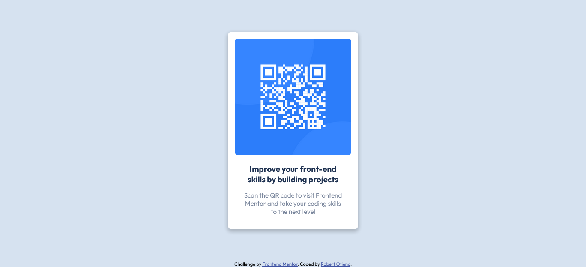

# Frontend Mentor - QR code component solution

This is a solution to the [QR code component challenge on Frontend Mentor](https://www.frontendmentor.io/challenges/qr-code-component-iux_sIO_H). Frontend Mentor challenges help you improve your coding skills by building realistic projects. 

## Table of contents

- [Overview](#overview)
  - [Screenshot](#screenshot)
  - [Links](#links)
- [My process](#my-process)
  - [Built with](#built-with)
  - [What I learned](#what-i-learned)
  - [Continued development](#continued-development)
  - [Useful resources](#useful-resources)
- [Author](#author)

**Note: Delete this note and update the table of contents based on what sections you keep.**

## Overview

### Screenshot



### Links

- Solution URL: [QR code component solution](https://www.frontendmentor.io/solutions/htmlcss-solution-using-flexbox-and-maxwidth-for-responsive-images-VJkh7xZUB)
- Live Site URL: [QR code component Live](https://robert-otieno.github.io/qr-code-component-main/)

## My process

### Built with

- Semantic HTML5 markup
- CSS custom properties
- Flexbox

### What I learned

I learnt how to create responsive images in css and how to use calc() to calculate the height of an element.

```css
img {
  max-width: 100%;
  height: auto;
}

.qr-code {
    min-height: calc(100vh - 14px);
}
```

### Continued development

I believe adding animations to the project will be super nice!

### Useful resources

- [Create Responsive Images](https://www.w3schools.com/howto/howto_css_image_responsive.asp) - This helped me make the QR Code Jpeg image responsive.
- [Generate Box Shadows](https://cssgenerator.org/box-shadow-css-generator.html) - This is a great tool for generating and styling awesome box shadows.

## Author

- Website - [Robert Otieno](https://robertotieno.rokeservices.com)
- Frontend Mentor - [@robert-otieno](https://www.frontendmentor.io/profile/robert-otieno)
